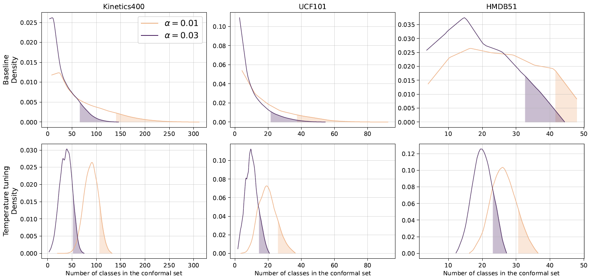

# Conformal Predictions for Human Action Recognition with Vision-Language Models (CP4VLM)
<a href="https://arxiv.org/abs/2502.06631" style="vertical-align:middle; display:inline;">
    
</a>

The official repository of the paper [*Conformal Predictions for Human Action Recognition with Vision-Language Models*](https://arxiv.org/abs/2502.06631).

Authors:
[Tim Bary*](https://scholar.google.com/citations?user=LgS_I5UAAAAJ&hl=en&oi=ao),
[Clément Fuchs*](https://scholar.google.com/citations?user=ZXWUJ4QAAAAJ&hl=en&oi=ao),
[Benoît Macq](https://scholar.google.com/citations?user=H9pGN70AAAAJ&hl=en&oi=ao).

*Denotes equal contribution.

## Overview

Despite recent advancements in Vision-Language Models (VLMs), predictions in Human Action Recognition (HAR) remain uncertain, making **Human-In-The-Loop (HITL)** approaches necessary. **Conformal Predictions (CP)** offer a principled way to reduce uncertainty by providing a set of possible labels with theoretical guarantees on the true label's inclusion, accelerating human decision. However, the resulting label sets often have **long-tailed distributions**, meaning that for some samples, the number of possible labels is not reduced much, leading to longer annotation times by the human operator. In settings where the maximum time per annotation is constrained (*e.g.*, live video monitoring), it is therefore necessary to reduce this tail.  

This repository implements a CP-based approach for HAR using pre-trained VLMs. Our method:  

- **Reduces label set size**: CP significantly decreases the number of candidate classes while preserving high coverage probabilities.  
- **Controls the long-tail effect**: We propose a **temperature tuning** strategy that shortens the tail of the set size distribution without additional calibration data. The Table hereunder shows that the temperature tuning strategy allows to reduce the 0.9-quantile of the distribution of the sizes of the sets of labels to choose from **by 25 to 30%** on three commonly used HAR datasets while maintaining a coverage of 99%. Figure 1 shows how the general shape of the distribution is impacted by the strategy and how the tail shifts towards the left.
 
| Dataset       | Number of <br> Classes | Base 0.9-quantile of set size <br> distribution ($\alpha = 0.01$) | Tuned 0.9-quantile of set size <br> distribution ($\alpha = 0.01$) | Tail Reduction |
|------------------|:-------:|:---------------:|:-----------:|:---------:|
| **Kinetics400**  | 400     | 138             | 103         | ~25%      |
| **UCF101**       | 101     | 37              | 26          | ~30%      |
| **HMDB51**       | 51      | 42              | 31          | ~26%      |

By integrating CP with VLMs and optimizing temperature parameters, we improve HITL efficiency, reducing **maximum human annotation time**.

<p align="center">
  
  <br>
  <em>Figure 1. Distribution of label set sizes on the Kinetics400, UCF101, and HMDB51 datasets before and after temperature tuning. This strategy shifts the distribution tail towards the left at the price of shifting the distribution mean towards the right. For more information, see our paper **link**. </em>
</p>

## Datasets
Please follow [DATASETS.md](DATASETS.md) to install the datasets.
You will get a structure with the following dataset names:
```
$DATA/
├── Kinetics400/
├── UCF101/
└── hmdb51/
```
Make sure to run `prepare_datasets.py` according to the instructions found in [DATASETS.md](DATASETS.md) after installing the datasets. The script will extract the frames from the video clips and encode them.

## Reproducing the Results

To reproduce the results, ensure at least one dataset is prepared, then run:

```bash
python main.py
```

This will generate a results file named `results_{$DATASET}_{$TIMESTAMP}.csv.gz`, where:

- `DATASET` is the name of the benchmarked dataset.
- `TIMESTAMP` is the exact time the script was executed (down to the second).

You can modify the output file location by changing the `PATH_TO_RESULTS` variable in `setup.py`.

### Customizing Parameters

The `main.py` script supports several configurable parameters. To view the available options, run:

```bash
python main.py --help
```

Below is an example of running `main.py` with all default parameters explicitly set:

```bash
python main.py --dataset ucf101 --backbone ViT-B/16 --n_folds 40 --n_shots 10 --temperatures_grid 10:200:5 --alphas_grid 0.01:0.15:0.02
```

## Visualizing the Results

Once a results file has been generated, you can create visualizations by running:

```bash
python make_figures.py
```

This script generates all the figures from [our paper](https://arxiv.org/abs/2502.06631), using the most recent results file by default. Figures are saved in the directory specified by the `PATH_TO_FIGURES` variable in `setup.py`.

### Customizing Figure Generation

The `make_figures.py` script also accepts parameters. Below is an example of running it with all default parameters explicitly specified:

```bash
python make_figures.py --results_file last --show True --figures 1 2 3 5
```

## Citation

If you find this repository useful, please consider citing our paper:<!-- Change arXiv number -->
```
@article{bary2025conformal,
  title={Conformal Predictions for Human Action Recognition with Vision-Language Models},
  author={Bary, Tim and Fuchs, Cl{\'e}ment and Macq, Beno{\^i}t}
  journal={arXiv preprint arXiv:2502.06631},
  year={2025}
}
```
## Contact

For any inquiries, please contact us at [tim.bary@uclouvain.be](mailto:tim.bary@uclouvain.be) and  [clement.fuchs@uclouvain.be](mailto:clement.fuchs@uclouvain.be) or feel free to [create an issue](https://github.com/tbary/CP4VLM/issues/new?template=Blank+issue).

## Acknowledgments
T.Bary and C.Fuchs are funded by the MedReSyst project, supported by FEDER and the Walloon Region. Part of the computational resources have been provided by the Consortium des Équipements de Calcul Intensif (CÉCI), funded by the Fonds de la Recherche Scientifique de Belgique (F.R.S.-FNRS) under Grant No. 2.5020.11 and by the Walloon Region.
